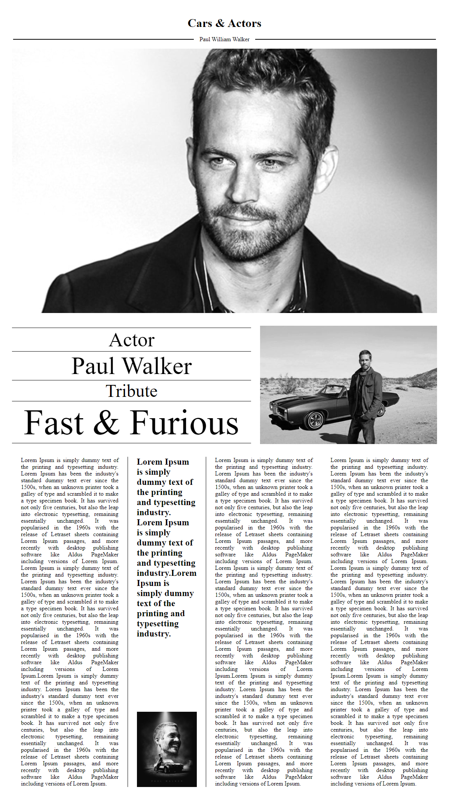
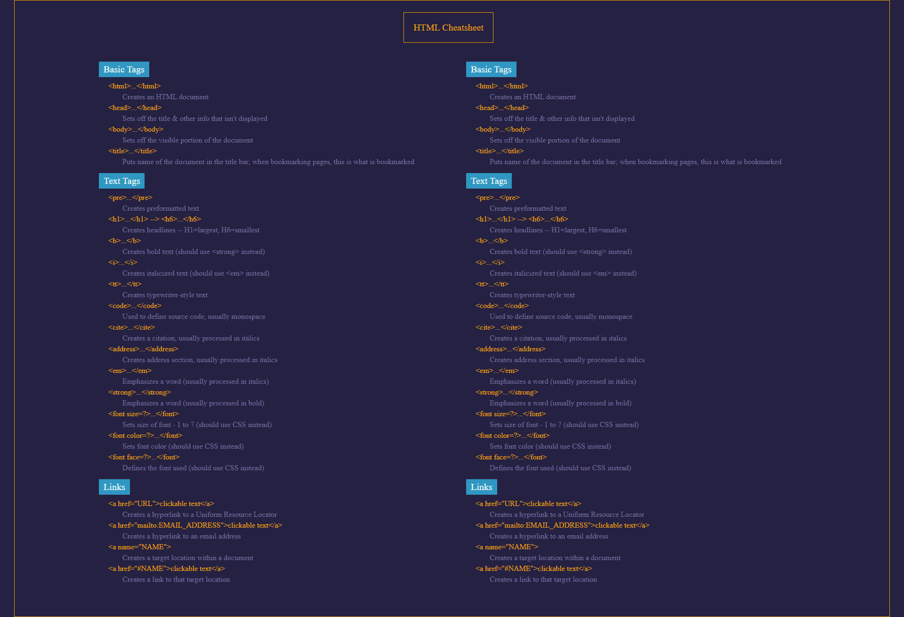
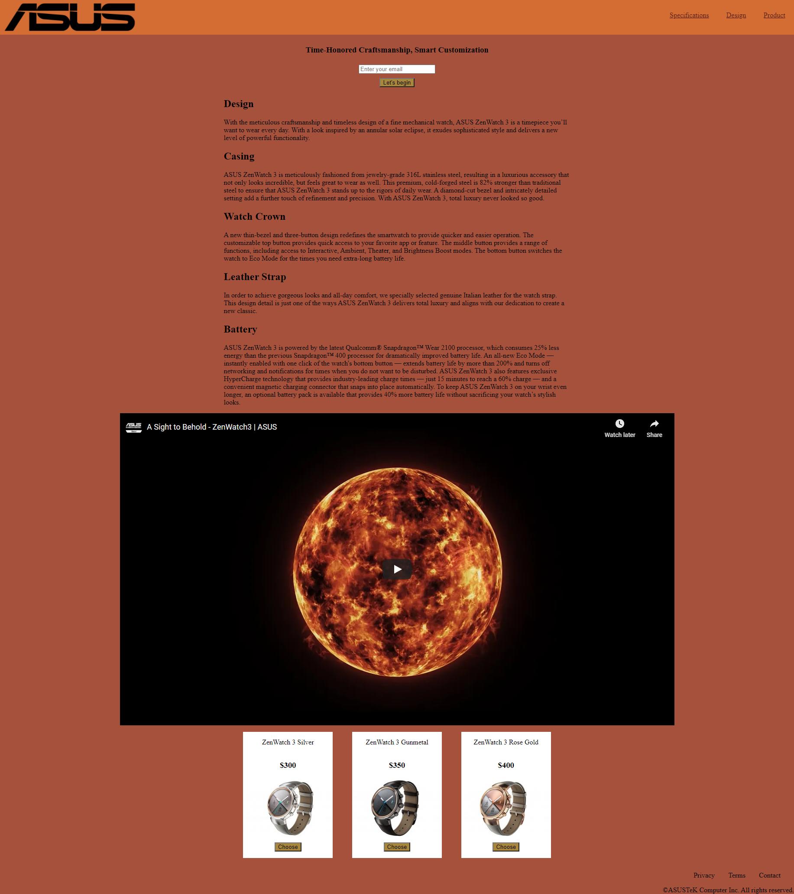
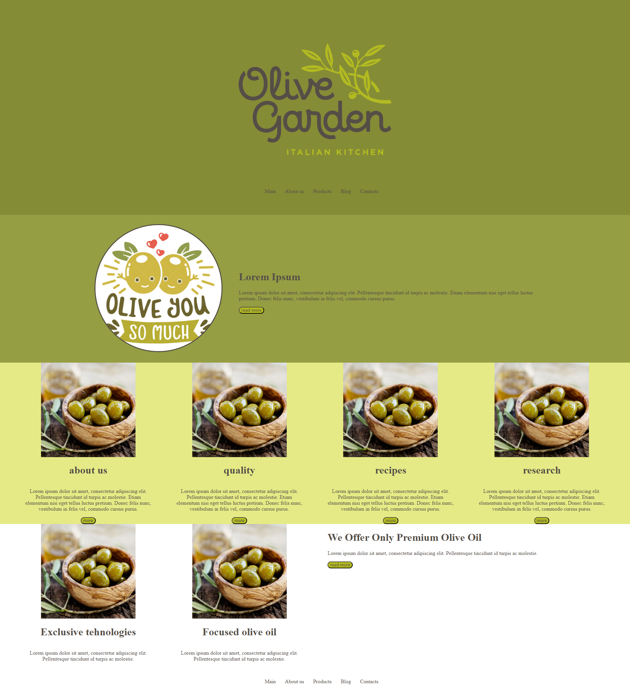
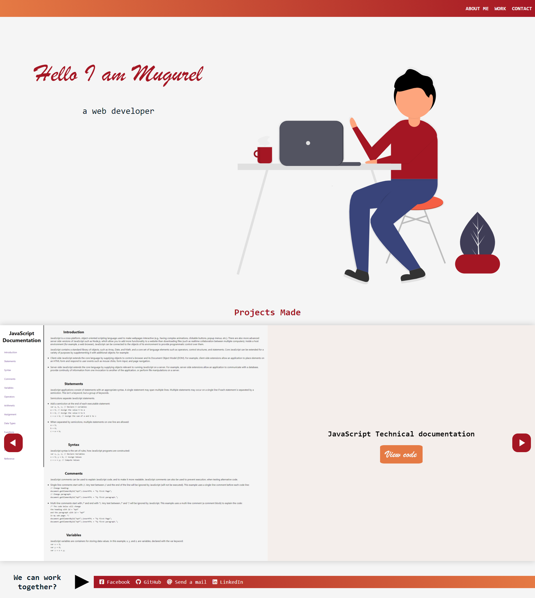

Projects made by following the courses from [FreeCodeCamp](https://www.freecodecamp.org)

Check my progress [HERE](https://www.freecodecamp.org/mugurel100)

This includes:

- Responsive Web Design Certification (300 hours) 
  - Basic HTML and HTML5 ✔️
  - Basic CSS ✔️
  - Applied Visual Design 
  - Applied Accessibility 
  - Responsive Web Design Principles 
  - CSS Flexbox 
  - CSS Grid 
- JavaScript Algorithms and Data Structures Certification (300 hours) 
  - Basic JavaScript 
  - ES6 
  - Regular Expressions
  - Debugging 
  - Basic Data Structures 
  - Basic Algorithm Scripting
  - Object Oriented Programming 
  - Functional Programming
  - Intermediate Algorithm Scripting
- Front End Development Libraries Certification (300 hours)
  - Bootstrap
  - jQuery
  - SASS
  - React
  - Redux
  - React and Redux
- Data Visualization Certification (300 hours)
  - Data Visualization with D3
  - JSON APIs and AJAX
- APIs and Microservices Certification (300 hours)
  - Managing Packages with NPM
  - Basic Node and Express
  - MongoDB and Mongoose
- Quality Assurance Certification (300 hours)
  - Quality Assurance and Testing with Chai
  - Advanced Node and Express
- Scientific Computing with Python Certification (300 hours)
  - Python for Everybody
- Data Analysis with Python Certification (300 hours)
  - Data Analysis with Python
  - Numpy
- Information Security Certification (300 hours)
  - Information Security with HelmetJS
  - Python for Penetration Testing
- Machine Learning with Python Certification (300 hours)
  - Tensorflow
  - How Neural Networks Work
- Coding Interview Prep (Thousands of hours of challenges)
  - Algorithms
  - Data Structures
  - Take Home Projects
  - Rosetta Code
  - Project Euler

# Responsive Web Design Certification Projects

- Tribute page 
  
- Technical Documentation 
  
- Survey Form 
  
- Asus Product Landing Page 
   
- Olive Product Page 
  
- Dodge Cars Presentation Page 
  
- Personal Portfolio Webpage 
    

# JavaScript Algorithms and Data Structures Projects

- Palindrome checker 
  
- Roman numeral converter 
  
- Caesars cipher 
  
- Phone validator 
  
- Cash register 
  
